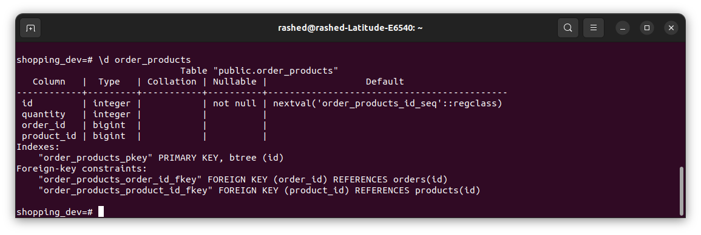

# API Requirements
The company stakeholders want to create an online storefront to showcase their great product ideas. Users need to be able to browse an index of all products, see the specifics of a single product, and add products to an order that they can view in a cart page. You have been tasked with building the API that will support this application, and your coworker is building the frontend.

These are the notes from a meeting with the frontend developer that describe what endpoints the API needs to supply, as well as data shapes the frontend and backend have agreed meet the requirements of the application. 

## API Endpoints
    0.0.0.0:3000

#### Products
    /api/products
- Index
  -     /all [GET]
    Response on success: Status 200
    ```json 
    [{
       'id': number,
       'name': string,
       'price': number,
       'category': string
    }]
    ```
- Show
  -     /product/:id [GET]
  - Response on success: Status 200
    ```json 
    {
        'id': number
        'name': string,
        'price': number,
        'category': string
    }
    ```

- Create [token required]
    - Needed Header: Authorization - Bearer + Token
    -     /add [POST]
    - JSON Body Object:
        ```json 
        {
            'name': string,
            'price': number,
            'category': string
        }
        ```

    - Response on success: Status 201
      ```json 
      {
          'id': number
          'name': string,
          'price': number,
          'category': string
      }
      ```
- Update [token required]
  - Needed Header: Authorization - Bearer + Token
  -     /product/:id [PUT]
  - JSON Body Object:
    ```json 
    {
        'name': string,
        'price': number,
        'category': string
    }
    ```

  - Response on success: Status 201
    ```json 
    {
        'id': number
        'name': string,
        'price': number,
        'category': string
    }
    ```
- delete
  - Needed Header: Authorization - Bearer + Token
  -     /product/:id [DELETE]
  - Response on success: Status 200
    ```json 
    {
        'id': number
        'name': string,
        'price': number,
        'category': string
    }
    ```

- [OPTIONAL] Top 5 most popular products 
- [OPTIONAL] Products by category (args: product category)
    -     /product_by_cat/:cat [GET]
    - Response on success: Status 200
      ```json 
      {
          'id': number
          'name': string,
          'price': number,
          'category': string
      }
      ```
#### Users
    /api/users
- Index [token required]
  - Needed Header: Authorization - Bearer + Token
  -     /all [GET]
    Response on success: Status 200
    ```json 
    [{
       'id': number,
       'firstName': string,
       'lastName': string,
       'email': string
    }]
    ```
- Show [token required]
  - Needed Header: Authorization - Bearer + Token
  -     /user/:id [GET]
    Response on success: Status 200
    ```json 
    {
       'id': number,
       'firstName': string,
       'lastName': string,
       'email': string
    }
    ```
- Create N[token required]
  -     /register [POST]
  - JSON Body Object:
      ```json 
      {
        'firstName': string,
        'lastName': string,
        'email': string,
        'password':string
      }
      ```

  - Response on success: Status 201
    ```json 
    {
      'id': number
      'firstName': string,
      'lastName': string,
      'email': string,
    }
    ```
- Login N[token required]
  -     /login [POST]
  - JSON Body Object:
      ```json 
      {
        'email': string,
        'password':string
      }
      ```
  - Response on success: Status 200 and JWT Token
    ```json 
    {
      {
        'id': number
        'firstName': string,
        'lastName': string,
        'email': string,
      },
      'token':string (SHA256)
    }
    ```
- Update [token required]
  - Needed Header: Authorization - Bearer + Token
  -     /user [PUT]
  - JSON Body Object:
    ```json 
    {
        'firstName': string,
        'lastName': string,
        'email': string
    }
    ```

  - Response on success: Status 201
    ```json 
    {
        'id': number
        'firstName': string,
        'lastName': string,
        'email': string
    }
    ```
- change Password [token required]
  - Needed Header: Authorization - Bearer + Token
  -     /user_password [PUT]
  - JSON Body Object:
    ```json 
    {
        'oldPassword': string,
        'newPassword': string,
    }
    ```

  - Response on success: Status 201 and JWT token
    ```json 
    {
      {
        'id': number
        'firstName': string,
        'lastName': string,
        'email': string
      },
      token:string (SHA256)
    }
    ```
- delete
  - Needed Header: Authorization - Bearer + Token
  -     /user [DELETE]
  - Response on success: Status 200
    ```json 
    {
        'id': number
        'name': string,
        'price': number,
        'category': string
    }
    ```
#### Orders
    /api/orders
- Create [token required]
  - Needed Header: Authorization - Bearer + Token
  -     /add [POST]
  - JSON Body Object:
  - case new product
      ```json 
      {
          'quantity': number,
          'product_id': number,
      }
  - case add product to specific order
      ```json 
      {
          'order_id':number
          'quantity': number,
          'product_id': number,
      }
  - Response on success: Status 201
    ```json 
    {
        'msg':string
    }
    ```
- get all orders
  -     /all [GET]
    Response on success: Status 200
    ```json 
    [{
        'order id': number,
        'quantity': number,
        'order status': string,
        'user first name': string,
        'user last name': string,
        'product name': string,
        'product category': string,
    }]
    ```
- get single order
  -     /order/:id [GET]
  - Response on success: Status 200
    ```json 
    {
        'order id': number,
        'quantity': number,
        'order status': string,
        'user first name': string,
        'user last name': string,
        'product name': string,
        'product category': string,
    }
    ```
- get user orders
  -     /order_by_user/:id [GET]
    Response on success: Status 200
    ```json 
    [{
        'order id': number,
        'quantity': number,
        'order status': string,
        'user first name': string,
        'user last name': string,
        'product name': string,
        'product category': string,
    }]
    ```
- Update order status [token required]
  - Needed Header: Authorization - Bearer + Token
  -     /order/:id [PUT]
  - JSON Body Object:
    ```json 
    {
        'status': string,
    }
    ```
  - Response on success: Status 201
    ```json 
    {
        'id': number
        'status': string,
        'user_id': string,
    }
    ```
- delete
  - Needed Header: Authorization - Bearer + Token
  -     /order/:id [DELETE]
  - Response on success: Status 200
    ```json 
    {
        'msg':string
    }
    ```
## Data Shapes
#### Product
-  id
- name
- price
- [OPTIONAL] category
```postgresql
CREATE TABLE products
(
    id       SERIAL PRIMARY KEY,
    name     VARCHAR(50) NOT NULL,
    price    integer     NOT NULL,
    category VARCHAR(50) NOT NULL
);
```

#### User
- id
- firstName
- lastName
- password
```postgresql
CREATE TABLE users
(
    id        SERIAL PRIMARY KEY,
    firstname VARCHAR(50) NOT NULL,
    lastname  VARCHAR(50) NOT NULL,
    password  VARCHAR(255) NOT NULL,
    email     VARCHAR(255) UNIQUE
);
```


#### Orders
- id
- id of each product in the order
- quantity of each product in the order
- user_id
- status of order (active or complete)
```postgresql
CREATE TABLE orders
(
    id      SERIAL PRIMARY KEY,
    status  VARCHAR(15),
    user_id bigint REFERENCES users (id)
);
```


```postgresql
CREATE TABLE order_products
(
    id         SERIAL PRIMARY KEY,
    quantity   integer,
    order_id   bigint REFERENCES orders (id),
    product_id bigint REFERENCES products (id)
);
```



